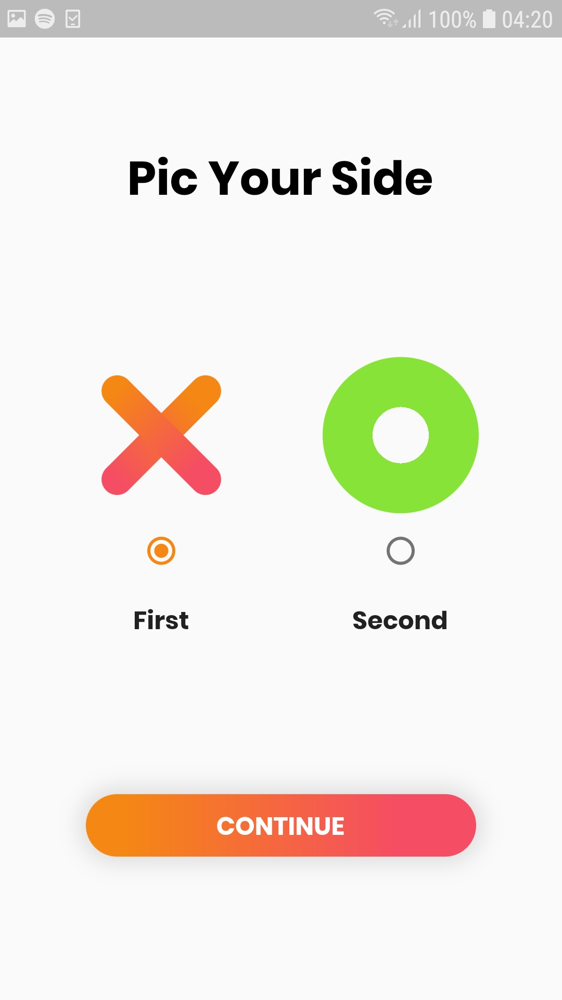

# Flutter Tic Tac Game 🎮 

This Tic-Tac-Toe game, developed using Flutter, a versatile open-source UI framework, offers an engaging gaming experience with a range of features:

Two-Player Mode: Challenge a friend to a battle of wits on the same device, making it a fun and interactive multiplayer game.

Intuitive Interface: Enjoy a user-friendly and easy-to-navigate interface that allows you to focus on the gameplay without any unnecessary distractions.

Winner Declaration: When the game reaches its conclusion, whether due to one player forming a horizontal, vertical, or diagonal line of their symbol, or if it's a draw, the game ensures that the outcome is clearly declared.

Reset Button: Feel free to start a new game whenever you like with the convenient reset button, ensuring that you can enjoy endless rounds of this classic game without any hassle.

With these features, this Tic-Tac-Toe game provides a delightful way for you and your friends to engage in friendly competition and test your strategic thinking. Whether you're on the go or just looking to pass the time, this game promises endless fun and excitement.
## Preview 📸
|                                           |                                           |                                           |
| ----------------------------------------- | ----------------------------------------- | ----------------------------------------- |
|  |  |  |

